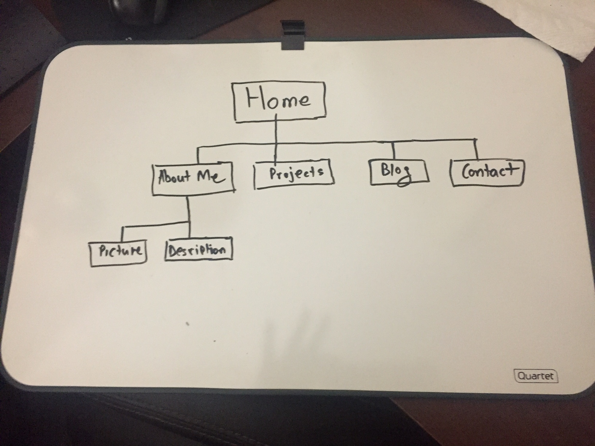

###What are the 6 Phases of Web Design?
	1. Information Gathering

		During this step, a developer researches and gathers important informations that will help
		build a site that is really catering to the clients needs. There are certain steps a dev
		can take to ensure a clients demands are met:

			*Purpose - What is the point of the site? Why are you making it? Is it to sell something
			or do you simply want to display some information to the user? These kinds of questions 
			are necessary to determine the purpose of the site.

			*Goals - Whatis the point of making this site? Is it to make money, provide a resource,
			share some information?

			*Target Audience - Who is the site for? Is it for teenager or maybe elderly people? What
			is the taget audience age or interests? All these things are taken into factor later when
			designing a site.

			*Content - What content will be on your site? Perhaps you will sell clothes? Or host
			many articles? Ultimately, the target audience will recieve this content.
		
	2. Planning
		
		At this phase, one thinks about a plan for their site. A greate tool that is often used is the
		site-map. A site-map helps you draw out a very general view of your site. Each section can be
		mapped out as well as sub-sections. This is great because you get to lay down a plan before
		designing your webstie, this way you have something reference anytime you need ideas. At this
		point a dev will also think about potential technologies that can be utilized to make the site
		work.

	3. Design

		The design of the site depends on a lot of the things you researched prior to design. What colors
		would work best for your site? What will the landing page look like? How big will the font be? 
		These are some things that a dev might think about when designing a site. A dev will usually draw up 
		a design in the form of a wire-frame, which is like a layout of the site you are making. This can be referenced when actually coding and developing the site. The wire-frame can also be used to show the 
		client what the site may look like and whether it is to the clients taste.

	4. Development
	
		This is the implementation phase of the cycle. This is the part when the developer takes the design
		and acutally writes HTML and CSS to make it come to life in the browser. A good place to start the
		design is to make the home page and build the rest of the site around the shell. It's also a good idea 
		to have a copy of your site running to get feed-back from a client and make additions based on that.

	5. Testing and Delivery
	
		At this point, the site is up and running. A dev will test out all the function of a site and make sure
		everything is functioning properly. This is also the time to see whether you are getting all the right
		information in the forms a user fills out on the site. A dev should also check whether the site is funtional
		on multiple platforms such as mobile and tablet (reponsive design). The client can give feedback at this point
		to the dev and the dev can implement changes at the clients will. A dev can also write automated tests
		to make sure everything is functioning properly and to standards. Once all the boxes tick off, a dev can
		deploy their server to a host to make it go online. If the dev did a good job, the site will be semantically
		correct and be optimzed for the search engines.

	6. Maintenance
	
		Maintenance is crucial to a sites longevity. A client can update the sites contents via a CMS (content-
		management-system) or hire the dev from time-to-time to update the site for them. If there are any bugs
		that are found in the site, a dev can fix those. They can also add additonal features that were not initally
		implemented. Maintenance is of course a preference... Some websites are maintained everyday while others are
		left alone for a long time.

###What is your site's primary goal or purpose? What kind of content will your site feature?

	The primary goal of my site is to be an online porfolio. This site will have my resume, a link to my
	github, my contact and projects I've worked on. It will mostly cater to future clients and other people
	who are interested in working with me. The site should have hints of my personality and give the visitors
	a straight forward interface to navigate.

###What is your target audience's interests and how do you see your site addressing them?

	I think the target audience's interest will be looking for potential employees. They may be looking for
	people to work on projects with them or a may be a recruiter. My site will adress that by providing 
	relavent information about myself and my background. It will exhibit my best works and give a overview
	of my personality.

###What is the primary "action" the user should take when coming to your site? Do you want them to search for 
###information, contact you, or see your portfolio? It's ok to have several actions at once, or different actions for 
###different kinds of visitors.

	The primary 'action' for the user who visits my site will probably be to view my portfolio as well as information on me. This may lead them to contact me by the time they leave this site. So essentially, it will be important to
	have things easy to do and access.

###What are the main things someone should know about design and user experience?
	
	The user good experience leaves a user with no frustration or confusion when interacting with a system. A well
	designed site will cater to the users need while also being accessable to anyone else using the system. It will
	take into consideration different mediums that are used to access the system. 

###What is user experience design and why is it valuable? 
	
	User experience design is user-centered. It may be easy to to say that but designing a good UX is actually a lot
	of work and takes a lot of research. Good UX can make or break an application. If a user is not happy using the 
	system, they will abandon it or will experience negative emotions.

###Which parts of the challenge did you find tedious?

	I didn't find any parts of the challange tedious.