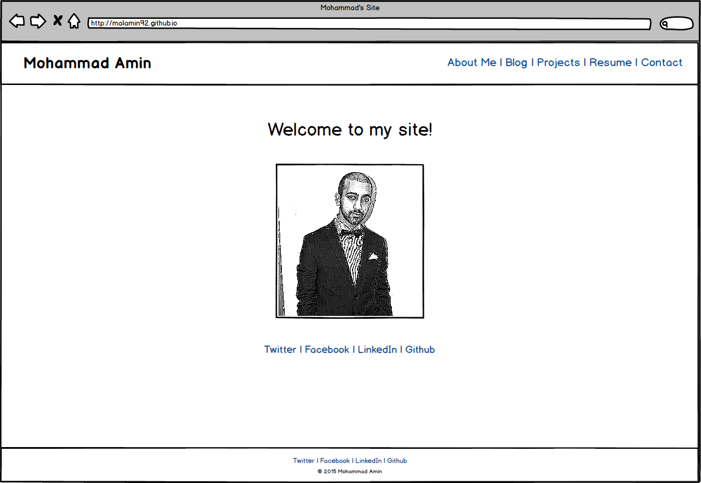
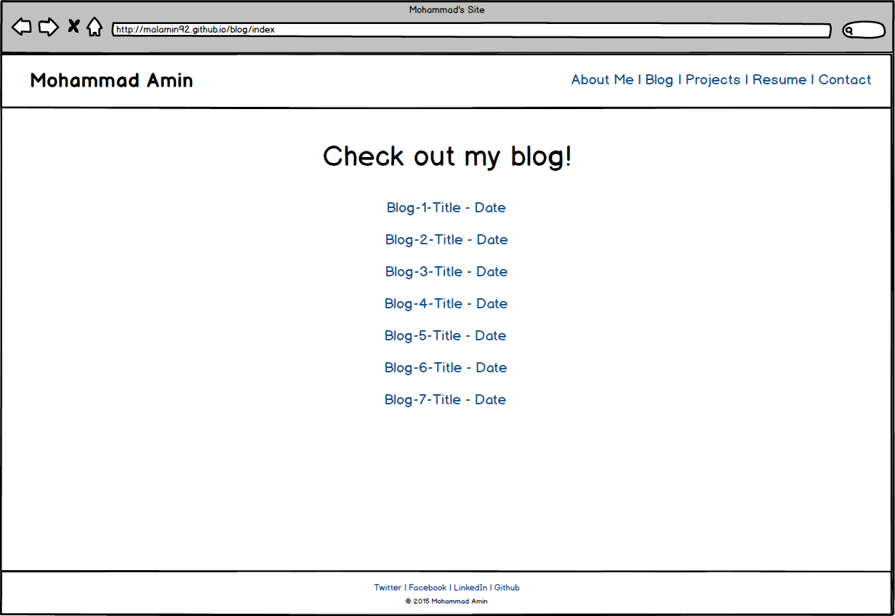

###What is a wireframe?

	A wireframe is like a sketch of the website you are trying to design. It is an "architectural blueprint" to
	the site you are making. It serves as a reference you can see before actually making your site. It sets a 
	basis as to what an user will see on your site and how they will interact with it. It is also minimal, usually
	done in black and white so that the designer can focus on structure rather than specfics. It should capture all the
	basis of your website without going into detail.

###What are the benefits of wireframing?

	There are several benefits to wireframing, one important one being that it allows you to design and revise. Before
	designing a web page, which is a lot more complicated, one can simply just create the layout via a wire frame. That
	way if changes need to be made, they can be made on the wireframe before actually going into the code. You can also
	get a great overview of the layout of a site by using a wireframe, a great way to see how a user will navigate the 
	site. When working with a client, a designer can use a wireframe to show the client what thye are thinking prior to
	designing the site in code. They can get feedback and make changes if the client wants to do so. Building a site
	is sort of like building a house and the wireframe is the blueprint.

###Did you enjoy wireframing your site?

	Yes, I really enjoyed wireframing my site. I don't consider myself a very creative person when it comes to design
	but the various tools that I discovered really sparked my interest. I used Balsamiq to create my wireframe and it
	was a blast thinking through the design of my site. I chose to stick to what seems like a classic layout for a 
	portfolio site and I liked how I was able to stick to my taste.

###Did you revise your wireframe or stick with your first idea?

	I started off with a design in mind but changed some aspects of the original. I checked out some portfolio sites
	that I thought were great and used the wirefy tool to check out the wireframes for those sites. This helped me get
	a good idea of what I wanted to do with my site and I worked off that. I made additions to the footer and header
	based on those ideas I gathered. 

###What questions did you ask during this challenge? What resources did you find to help you answer them?

	I definitely asked which tool I should use to to wireframe my site. There are so many options and I explored some
	of them before I settled on Balsamiq as my choice. It seems that a lot of people recomend it and I really loved
	its simplicty. It also gave me great pre-made modules that seem standard on most websites I user, so that really
	helped get me going.

###Which parts of the challenge did you enjoy and which parts did you find tedious?

	The part I enjoyed the most was definelty the wireframing. Designing the sketch of my website was really awesome
	because I really liked laying out the site and mocking up where everything will go. It was an enjoyable process
	because I felt kind of artsy, haha. The part I didn't like was picking one specific tool to use out of the various,
	and I mean, verryy veryyy various, options. However, it was worth is because I really like the tool I did pick.

