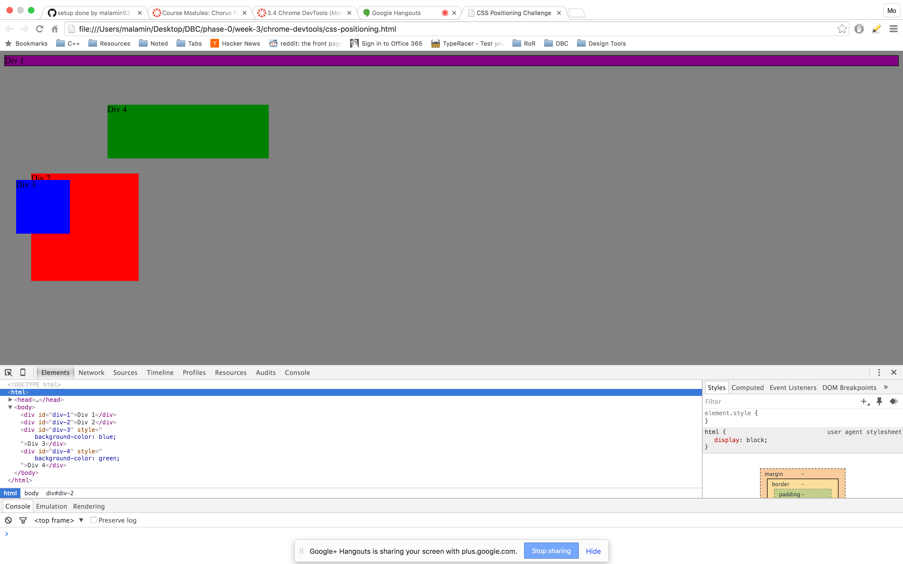
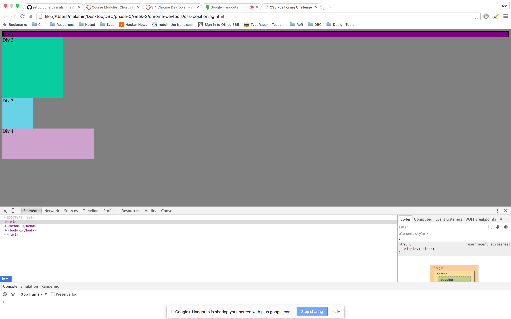
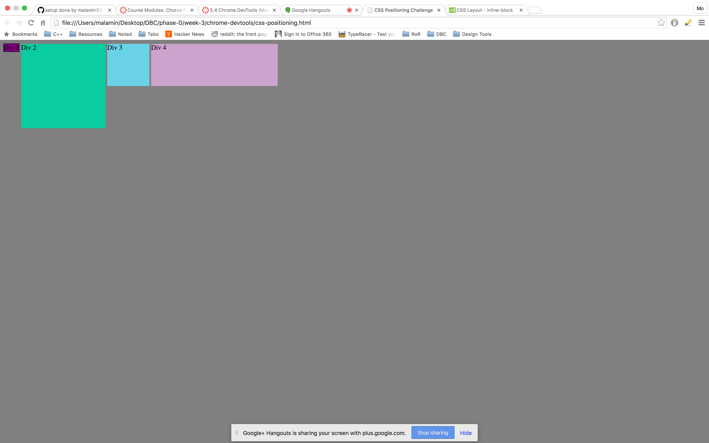
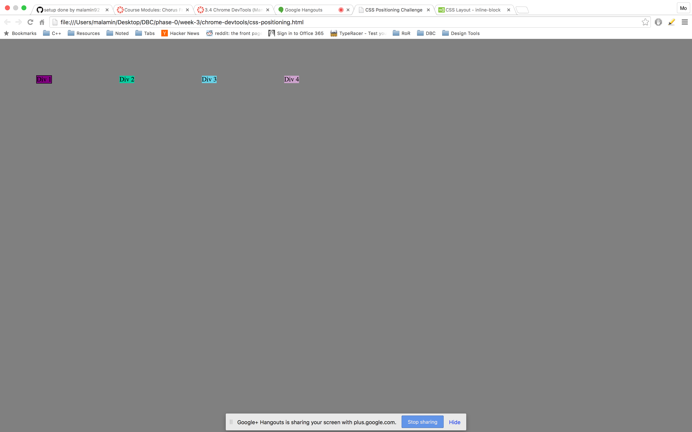
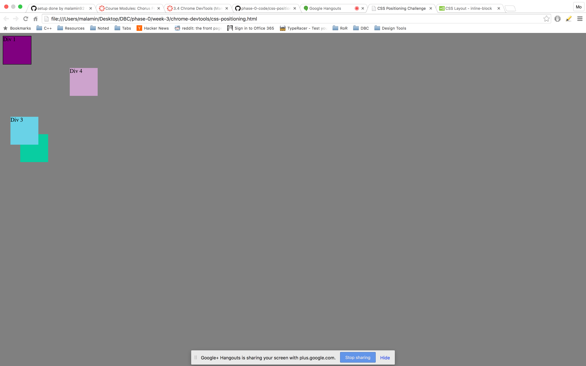
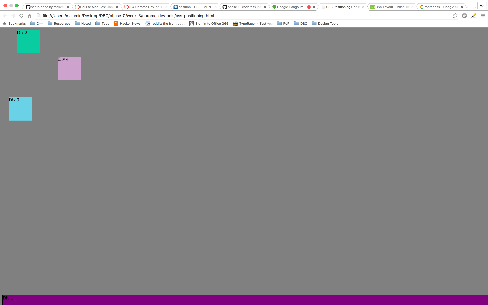
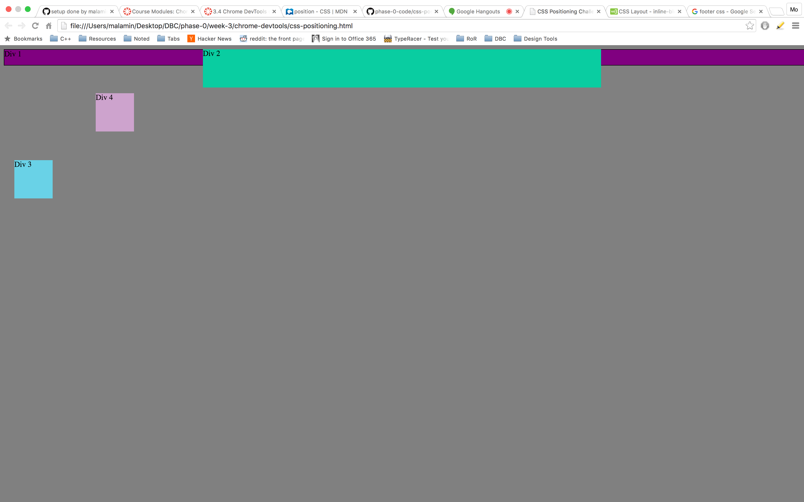
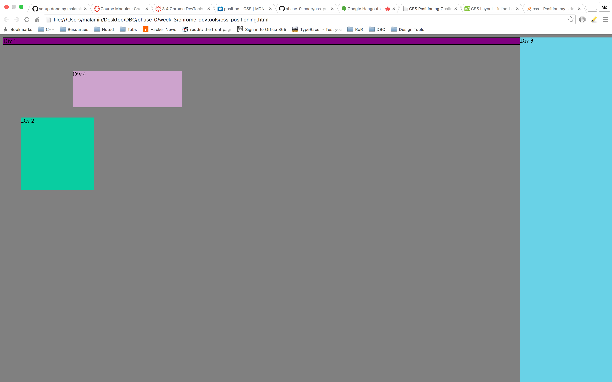
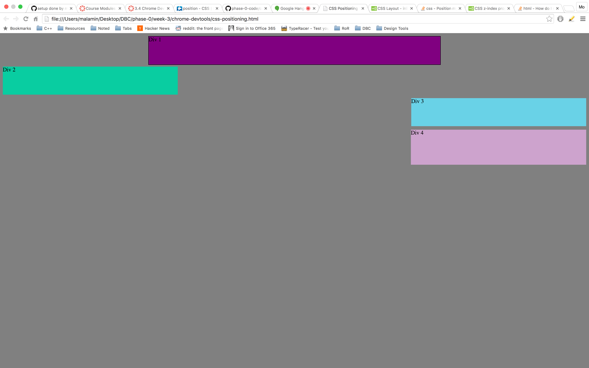

####How can you use Chrome's DevTools inspector to help you format or position elements?
	
	Chrome dev tools can help you see what's going on, on the page. It allows you to make real time changes on the page 
	and see the results of those changes in a flash. This can help you get an idea of what to put in your HTML and CSS
	before you change the code. This can also help you debug as you can visualize how each element on the page is behaving,
	including the margins that are invisible otherwise. If you don't understand how a certain attribute works, you can
	just remove it and see how it affects the page. Chrome DevTools is defintely very useful to a web developer.

####How can you resize elements on the DOM using CSS?

	Using the 'height' and 'width' properties, you can change the height and width of and element to your desire. You can set
	the pixels with 'px', use relative sizing with 'em' or use '%'. You can set the margins of an element to be large and have
	the element itself be small to create spacing affect your element.  

####What are the differences between absolute, fixed, static, and relative positioning? Which did you find easiest to use? Which was
####most difficult?

	Absoulte positioning is when an element gets positioned in relation to its nearest ancestor. Fixed is when an element is 
	positioned in relation to the screen that the HTML is viewed on. Static is HTML's default position value and those elements
	are not affected by the top, botom, left and right properties. Relative is when an element is positioned according to its normal
	position. I think static is the easiest to use, I normally don't include a 'postion' attribute in most HTML that I write. I think
	absolute is the hardest to use because it just confuses me sometimes.

####What are the differences between margin, border, and padding?

	Padding is the space between the element and its border. Border is the line that goes around an element, it comes after the 
	padding, between the margin and the padding. The margin is the invisible box that serves as a cushion around the border, the
	distance between two elements. 

####What was your impression of this challenge overall? (love, hate, and why?)

	I thought it was fun and challanging at times. Didn't have too much trouble with it, and learned some new tricks. So
	I enjoyed it overall.

